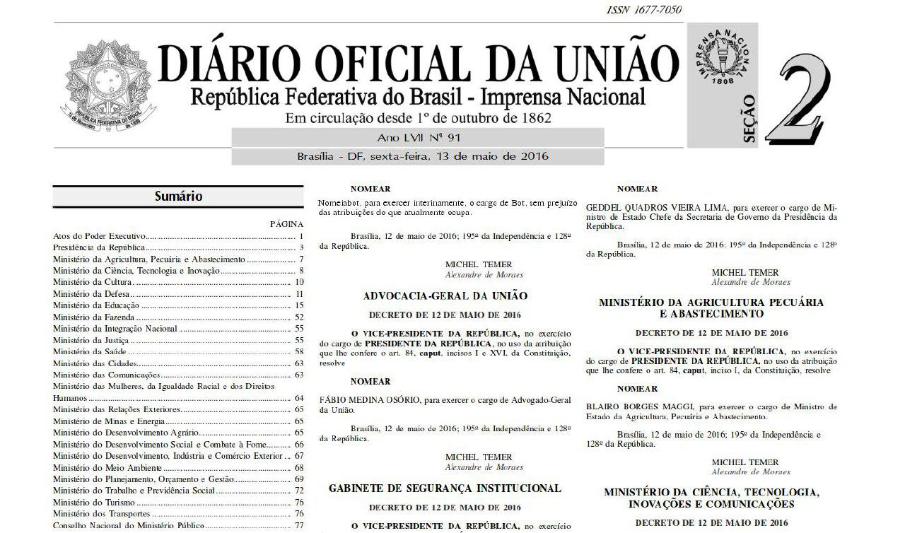

# Bots do Telegram

## Desativados em 17 maio de 2016. 

###### Bots criados com o fim de entreter. Não devem ser levados a sério.

O usuário envia o texto e o bot completa as informações na imagem base.



## Uso

Adicione os tokens no arquivo `bot.conf` seguindo o modelo:
```
[NOMEIA]
TOKEN = TOKEN_NOMEIABOT

[EXONERA]
TOKEN = TOKEN_EXONERA
```

Instale os requisitos:

```
pip install -r requirements.txt
```

Execute os bots:

```
python ExoneraBot.py
python NomeiaBot.py
```

## Observações

A fonte utilizada está contida no arquivo `nimbus.ttf`. Sugere outra? Faça um Pull Request! :)
